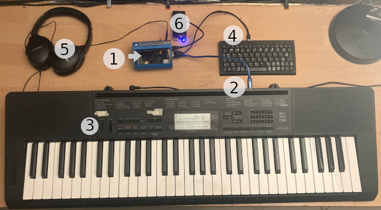

# miniMidiOut

A "fast" midi input to audio output synthesizer with 5 popular waveforms.

## It is not realy realtime

Messure delay between key press and audio out:

- Pi1: *64ms*
- eeepc: *48ms*

## Usage

You can use (and build) the command line interface (CLI) `miniMidiOut` on many Linux systems. It does not use a realtime linux-kernel.

An alternative way via [Release Files](https://github.com/no-go/miniMidiOut/releases):

- use my Pi1 sd-card content (just a single FAT32 partition is needed)
- use my sd-card image for the eeepc 4G 701 (32bit Pentium, BIOS boot)

With these files/images the system boots a minimal Linux and autostarts `miniMidiOut`.

1. plugin sd-card
2. plugin MIDI USB keyboard
3. if the MIDI USB keyboard has its own power button: power on!
4. optional: plugin an USB alphanumeric keyboard
5. plugin your headphones to the analog audio
   - pi1: `config.txt` force analog audio (not HDMI)
   - pi1: Attention! There is a 4th connection for analog video in the 3.5mm hole :-S
6. power on the Pi1 (or eeepc)
7. wait 16 seconds until 3 tones comes up
8. **enjoy classic synthesizer sounds from the 80th !**
9. power off the Pi1 (or eeepc)

## Features (alphanumeric keyboard)

- press `1` for sinus
- press `2` for saw
- press `3` for square
- press `4` for triangle
- press `5` for noise
- press `0` for sustain

Change fading out the tone (release):

- press `6` for default
- press `7` for a long fade out
- press `8` for no fade out
- press `9` toggles
  - automatic fade out on
  - automatic fade off
  - glissando up
  - glissando down

Change octave:

- press `-` to set down
- press `.` to set up

## Feature (MIDI keyboard)

- velocity
- pitch bend
- sustain pedal

Switch through the waveforms **saw**, **square**, **triangle**, **noise** and **sinus**:

- no sound should be played
- you press the sustain pedal 3 times in 1.5 seconds

[Listen to the Audio File](https://raw.githubusercontent.com/no-go/miniMidiOut/refs/heads/main/misc/example.mp3)

## Bugs

On pi1: hotplug (out) the midi keyboard gives a "urb status -32". If you add `dwc_otg.speed=1` to
the `cmdline.txt`, it is a fix, but a USB keyboad/numpad will not work.

## Details

See [this file](misc/DETAILS.md) for more details to build and use `miniMidiOut`.
