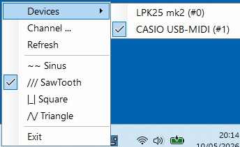

# synth0815

A midi synthesizer running as systray application.

## features

- 4 waveforms: sinus, sawtooth, square, triangle
- many voices
- automatic use first midi device, if only 1 exists
- velocity
- pitch
- sustain
- release volumen during key press
- midi device is selectable
- channel is selectable (channel 0 = all channels)
- ONLY non typical errors or events are written to a log file!
- press 3x sustain on silence to switch through wavforms

## missing

- config file
- more error handling (e.g. midi device is no keyboard or hotpluging issues)
- unit tests
- comments or doc in code
- no setup or CI/CD routine
- missing tests for realtime: how many ms delay between key-press and audio out?
